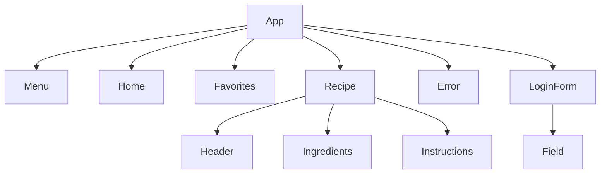
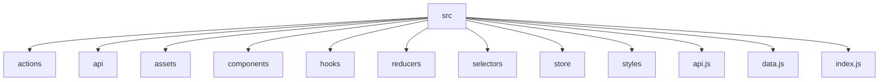

# `Recipes App 🍴`

## Table des matières

1. [Présentation](#1-présentation)
2. [Structure des dossiers et responsabilités](#2-structure-des-dossiers-et-responsabilités)
3. [Flux de données et navigation](#3-flux-de-données-et-navigation)
4. [Configuration et environnement](#4-configuration-et-environnement)
5. [Patterns et bonnes pratiques](#5-patterns-et-bonnes-pratiques)
6. [Exemples d’utilisation](#6-exemples-dutilisation)
7. [Extensibilité et personnalisation](#7-extensibilité-et-personnalisation)
8. [Diagramme de structure des fichiers](#8-diagramme-de-structure-des-fichiers)
9. [Gestion des Recettes](#9-gestion-des-recettes)
10. [Gestion Utilisateur & Authentification](#10-gestion-utilisateur--authentification)
11. [Gestion des Favoris](#11-gestion-des-favoris)
12. [Gestion des Erreurs et Navigation](#12-gestion-des-erreurs-et-navigation)
13. [Pour aller plus loin](#13-pour-aller-plus-loin)
14. [Auteur](#14-auteur)
15. [Support](#15-support)

---

## 1. Présentation

> [!NOTE]
> Recipes App est une application web permettant aux utilisateurs de découvrir et de gérer des recettes culinaires.
>
> Construite avec **React**, elle intègre une gestion avancée de l'état via **Redux** et des appels API avec gestion des annulations via **AbortController**.

- **React** pour la construction de l’interface utilisateur.
- **Redux** pour la gestion de l’état global.
- **React Router** pour la navigation.
- **Axios** pour les appels API, avec gestion avancée des annulations via `AbortController`.
- **SCSS** pour des styles modulaires et maintenables.

## 2. Structure des dossiers et responsabilités

```bash
src/
├── actions/        # Actions Redux (intention de modifications)
├── api/            # Appels API centralisés
├── assets/         # Ressources statiques (images, icônes, polices)
├── components/     # Composants React (UI et pages)
├── hooks/          # Hooks personnalisés
├── reducers/       # Réducteurs Redux
├── selectors/      # Sélecteurs Redux
├── store/          # Configuration du store Redux
├── styles/         # Styles globaux et spécifiques
├── api.js          # Point d’entrée API global
├── data.js         # Données statiques ou mock
└── index.js        # Point d’entrée principal de l’application
```

### Détail des principaux modules

#### `actions/`

- Définit les intentions de modification de l’état (ex : ajout de recette, connexion utilisateur).
- Organisé par domaine (`recipes.js`, `user.js`).

#### `api/`

- Centralise les appels à l’API distante (ex : récupération des recettes).
- Utilise Axios et `AbortController` pour une gestion fine des requêtes.

#### `assets/`

- Contient les ressources statiques : images, icônes, polices, favicon, etc.
- Le fichier `index.html` sert de template principal pour l’application.

#### `components/`

- Regroupe tous les composants React, organisés par fonctionnalité ou page.
- Exemples :
  - `App/` : composant racine, gestion du layout global.
  - `Menu/`, `Home/`, `Recipe/`, `Favorites/` : pages principales.
  - `Card/`, `Content/`, `Error/` : composants UI réutilisables.
  - Sous-dossiers pour les sous-composants (ex : `Recipe/Header/`, `Recipe/Ingredients/`).

#### `hooks/`

- Contient les hooks personnalisés, comme `useAuth` pour la gestion de l’authentification.

#### `reducers/`

- Définit la logique de transformation de l’état Redux.
- Séparé par domaine (`recipes.js`, `user.js`), combiné dans `index.js`.

#### `selectors/`

- Fournit des fonctions pour extraire ou transformer les données du store Redux.

#### `store/`

- Configure le store Redux, combine les reducers et applique les middlewares.

#### `styles/`

- Fichiers SCSS pour les styles globaux (`index.scss`, `_reset.css`, `_vars.scss`) et spécifiques à chaque composant.

---

## 3. Flux de données et navigation



- **App** : point d’entrée, gère le routage et le layout.
- **Menu** : navigation principale.
- **Home** : page d’accueil, liste des recettes.
- **Favorites** : gestion des recettes favorites.
- **Recipe** : page de détail d’une recette, composée de sous-composants.
- **Error** : page d’erreur pour les routes non valides.
- **LoginForm** : formulaire de connexion utilisateur.

---

## 4. Configuration et environnement

- **Webpack** : configuration personnalisée pour le développement et la production (`config/webpack.*.js`).
- **PostCSS** : pour la transformation des styles.
- **ESLint** : configuration stricte pour la qualité du code.
- **Node.js v16+** recommandé.
- **API Express Recipes** : l’application consomme une API distante pour les données de recettes.

---

## 5. Patterns et bonnes pratiques

- **Separation of Concerns** : chaque dossier/module a une responsabilité claire.
- **Redux** : actions, reducers et selectors bien séparés pour la scalabilité.
- **Gestion des effets de bord** : utilisation d’`AbortController` pour éviter les fuites de mémoire lors des appels API.
- **Styles modulaires** : chaque composant possède son propre fichier SCSS.
- **Extensibilité** : architecture pensée pour l’ajout de nouvelles pages ou fonctionnalités (pagination, tests, accessibilité).

---

## 6. Exemples d’utilisation

### Lancer l’application en développement

```bash
yarn start
# Accès à http://localhost:8080
```

### Ajouter une nouvelle page

1. Créer un dossier dans components (ex : `About/`).
2. Ajouter le composant React et le fichier de style.
3. Définir la route dans le composant principal `App/index.js` via React Router.

### Ajouter une nouvelle action Redux

1. Définir l’action dans actions.
2. Ajouter le reducer associé dans reducers.
3. Mettre à jour le store si nécessaire.

---

## 7. Extensibilité et personnalisation

- **Pagination** : ajouter un composant dédié et adapter les appels API.
- **Design System** : intégrer une librairie de composants UI ou créer des composants réutilisables.
- **Tests** : ajouter Jest et React Testing Library pour la couverture unitaire.
- **Accessibilité** : suivre les recommandations WAI-ARIA dans les composants.

---

## 8. Diagramme de structure des fichiers



---

## 9. Gestion des Recettes

### 1. Component Name

- Recipes Logic (actions/recipes.js, reducers/recipes.js, selectors/recipes.js, api/recipes.js)

### 2. Purpose

- Permettre aux utilisateurs d’explorer, consulter, et gérer des recettes culinaires.
- Représente le domaine “recette” : recherche, affichage, favoris.

### 3. Key Responsibilities

- Charger la liste des recettes depuis l’API.
- Gérer l’état de chargement, d’erreur et de données.
- Permettre l’ajout et la suppression de recettes des favoris.
- Assurer la cohérence des données affichées (annulation des requêtes inutiles).

### 4. Workflows / Use Cases

- **Affichage des recettes** : déclenché à l’ouverture de la page d’accueil ou lors d’une recherche.
  - Étapes : requête API → gestion du loading → affichage ou erreur.
- **Ajout aux favoris** : action utilisateur sur une recette.
  - Étapes : mise à jour du store Redux → affichage dans la page favoris.
- **Annulation de requête** : navigation rapide ou changement de filtre.
  - Étapes : AbortController annule la requête en cours → évite l’affichage de données obsolètes.

### 5. Inputs and Outputs

- **Inputs** : paramètres de recherche, identifiant de recette, actions utilisateur (favoris).
- **Outputs** : liste de recettes, état de chargement, erreurs, liste de favoris.

### 6. Dependencies

- API Express Recipes (backend).
- Modules Redux (store, actions, reducers).
- Axios pour les appels HTTP.

### 7. Business Rules & Constraints

- Une recette ne peut être ajoutée aux favoris qu’une seule fois.
- Les recettes affichées doivent être à jour et cohérentes avec l’API.
- Les erreurs de chargement doivent être gérées et affichées à l’utilisateur.

### 8. Design Considerations

- Utilisation d’AbortController pour éviter les fuites de mémoire et les conflits de données.
- Découpage clair entre actions, reducers et sélecteurs pour faciliter l’extension.
- Risque : gestion des favoris côté client uniquement (pas de persistance serveur).

---

## 10. Gestion Utilisateur & Authentification

### 1. Component Name

- User Logic (actions/user.js, reducers/user.js, selectors/user.js, hooks/useAuth.js, components/LoginForm/)

### 2. Purpose

- Gérer l’authentification et l’état utilisateur.
- Représente le domaine “utilisateur” : connexion, session, accès aux fonctionnalités.

### 3. Key Responsibilities

- Authentifier l’utilisateur via formulaire de connexion.
- Stocker l’état de connexion dans Redux.
- Permettre l’accès aux fonctionnalités réservées (ex : favoris).
- Gérer la déconnexion et la réinitialisation de l’état utilisateur.

### 4. Workflows / Use Cases

- **Connexion** : déclenchée par soumission du formulaire.
  - Étapes : validation des champs → requête API → mise à jour du store → redirection.
- **Déconnexion** : action utilisateur.
  - Étapes : reset du store → retour à l’état non connecté.
- **Accès aux favoris** : conditionné par l’état de connexion.

### 5. Inputs and Outputs

- **Inputs** : identifiants utilisateur, actions du formulaire.
- **Outputs** : état de connexion, erreurs de login, accès aux pages protégées.

### 6. Dependencies

- API Express Recipes (authentification).
- Redux (store, actions, reducers).
- React Router (navigation conditionnelle).

### 7. Business Rules & Constraints

- L’accès aux favoris nécessite une session utilisateur valide.
- Les erreurs de connexion doivent être affichées clairement.
- Les données utilisateur ne sont pas persistées côté serveur (sauf si API étendue).

### 8. Design Considerations

- Utilisation d’un hook personnalisé (`useAuth`) pour centraliser la logique d’authentification.
- Risque : gestion locale de la session, non persistée après refresh (sauf extension).
- Séparation stricte entre logique métier et présentation (formulaire vs. store).

---

## 11. Gestion des Favoris

### 1. Component Name

- Favorites Logic (reducers/recipes.js, selectors/recipes.js, components/Favorites/)

### 2. Purpose

- Permettre aux utilisateurs de sauvegarder et consulter leurs recettes préférées.

### 3. Key Responsibilities

- Ajouter/retirer une recette des favoris.
- Afficher la liste des favoris.
- Empêcher les doublons dans les favoris.

### 4. Workflows / Use Cases

- **Ajout aux favoris** : action utilisateur sur une recette.
  - Étapes : mise à jour du store → affichage dans la page favoris.
- **Retrait des favoris** : action utilisateur sur la page favoris.
  - Étapes : suppression du store → mise à jour de l’affichage.

### 5. Inputs and Outputs

- **Inputs** : identifiant de recette, action utilisateur.
- **Outputs** : liste des favoris, état mis à jour.

### 6. Dependencies

- Redux (store, actions, reducers).
- Composants UI (Favorites, Card).

### 7. Business Rules & Constraints

- Une recette ne peut figurer qu’une fois dans les favoris.
- Les favoris sont liés à la session utilisateur (non persistés côté serveur).

### 8. Design Considerations

- Stockage local des favoris pour rapidité et simplicité.
- Risque : perte des favoris après déconnexion ou refresh (sauf extension).
- UI réactive : mise à jour instantanée du composant Favorites.

---

## 12. Gestion des Erreurs et Navigation

### 1. Component Name

- Error Handling & Routing Logic (components/Error/, React Router config)

### 2. Purpose

- Garantir une navigation fluide et une gestion explicite des erreurs pour l’utilisateur.

### 3. Key Responsibilities

- Rediriger vers une page d’erreur en cas de route non valide.
- Afficher les messages d’erreur lors des échecs API ou actions utilisateur.

### 4. Workflows / Use Cases

- **Route inconnue** : navigation vers une URL non gérée.
  - Étapes : détection → redirection vers Error.
- **Erreur API** : échec de chargement des recettes ou login.
  - Étapes : capture de l’erreur → affichage dans le composant Error.

### 5. Inputs and Outputs

- **Inputs** : erreurs techniques, navigation utilisateur.
- **Outputs** : affichage d’un message d’erreur, redirection.

### 6. Dependencies

- React Router.
- Composants Error.

### 7. Business Rules & Constraints

- Toute erreur doit être communiquée à l’utilisateur de façon claire.
- Les routes non valides ne doivent pas afficher de page blanche.

### 8. Design Considerations

- Centralisation de la gestion des erreurs pour cohérence UX.
- Risque : erreurs non capturées si logique métier étendue sans mise à jour du handler.

---

## 13. Pour aller plus loin

- Consultez le fichier README.md pour les scripts disponibles et les recommandations d’amélioration.
- La documentation de chaque composant et module peut être enrichie avec des commentaires JSDoc pour faciliter l’onboarding des nouveaux contributeurs.

---

## 14. **Auteur**

👤 **Yan Berdin**

- Website: [@yanberdin.com](<https://www.yanberdin.com>)
- Github: [@Yan{GitHub}](https://github.com/YanBerdin)
- LinkedIn: [@Yan{LinkedIn}](https://www.linkedin.com/in/yan-berdin)

---

## 15. **Support**

Give a ⭐️ if this project helped you!

---
